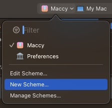
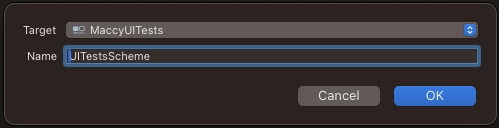
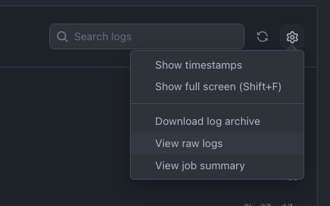

# On the Impact of Hitting System Resource Limitations on Test Flakiness

This repository contains the code for the [FTW](https://conf.researchr.org/home/icse-2024/ftw-2024) paper "On the Impact of Hitting System Resource Limitations on Test
Flakiness". We also provide step by step instructions on how to expand the provided dataset, available on [FigShare](https://figshare.com/s/a983c7fe642ba7202dd8).

## Generating Aggregated Statistics File from a Project

### Retrieving the Data
1. Copy the GitHub Workflow file `workflow.yml` into the projects you want to include. To be recognized by GitHub, it needs to be put in that project's folder `.github/workflows/`.
- In the workflow file:
	- change `<path-to-proj.xcodeproj>` with the actual path to the project file (or workspace).
	- change `<scheme>` to the name of the scheme in the project containing the UI Tests. If not present, open the project, create a new scheme and select only the UI Tests' target.

  
See screenshots

- Push the changes to GitHub. GitHub will recognize the workflow and start running the UI Tests. You can access the run in the Actions tab of the GitHub Project.
- Once finished, access the workflow's details.
	- Download the artifact named `raw-stats` containing a json file with all resource measurements. Unzip and save this file in the folder `data`.
	- Click on the workflow's job `ui-tests-run` and "View the raw logs" to export the logs file. Save the file as `logs.file` and put it `data`.

  
See screenshots

### Generating the Aggregated Statistics Dataset

cd into `parse-logs` and execute `npm run build; npm run run`. A json file containing the aggregated data will be generated at `data/aggregated-stats.json`.

If you have multiple projects you can merge the json arrays in each `aggregated-stats.json` into one.

## Analysing the Dataset

1. Make sure to have a `aggregated-stats.json` file in `data`. This could contain the data from a single or multiple projects.
2. install the required python libraries: `pip install -r requirements.txt`
3. Open `dataset-analysis.ipynb`
4. Execute the Jupyter Notebook. If you do not have LaTeX installed remember to update the respective variable inside of the notebook to generate the plots.